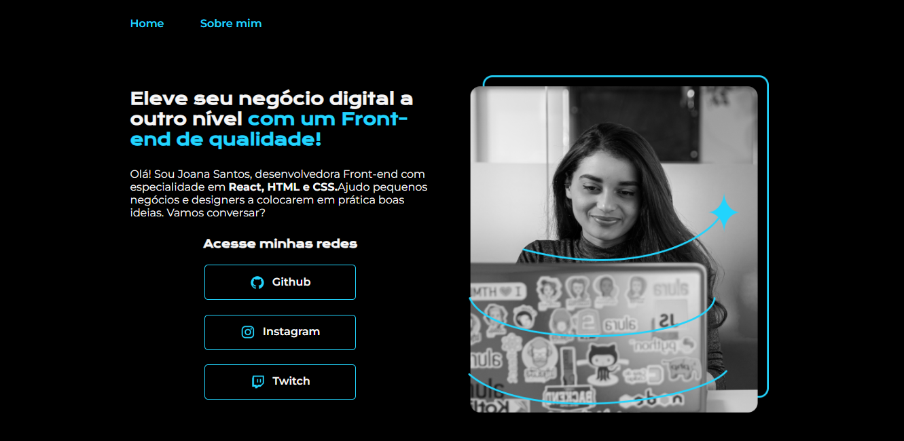

<h1 align="center">Portfólio</h1>

<h1 align="center">

</h1>

Este é um projeto usando <strong>HTML,CSS e flex-box </strong>do curso ONE da alura que além de estilizar com CSS também é responsivo para diferentes tamanhos de tela.  

